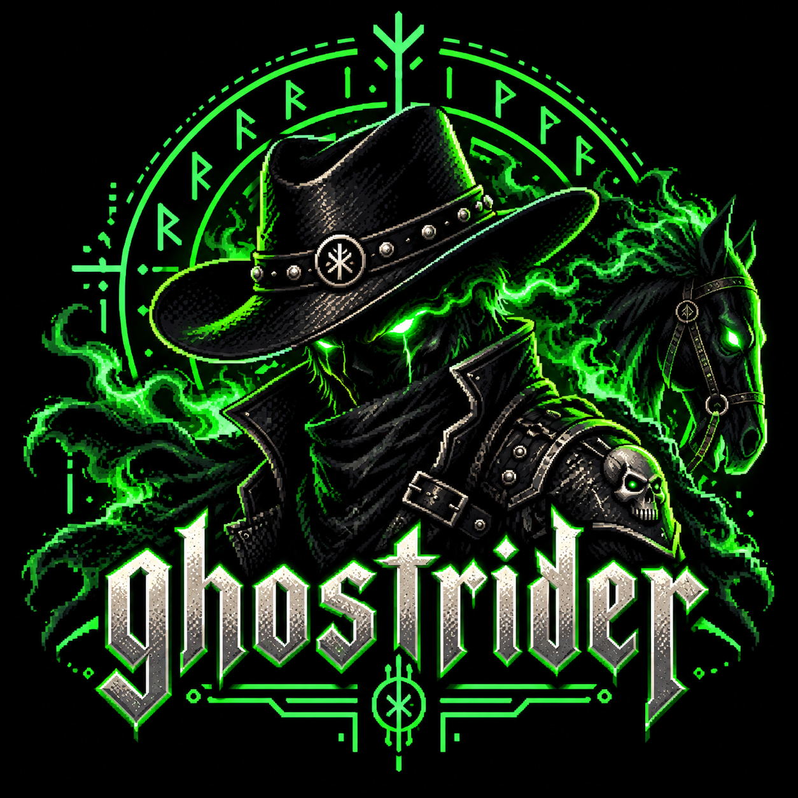
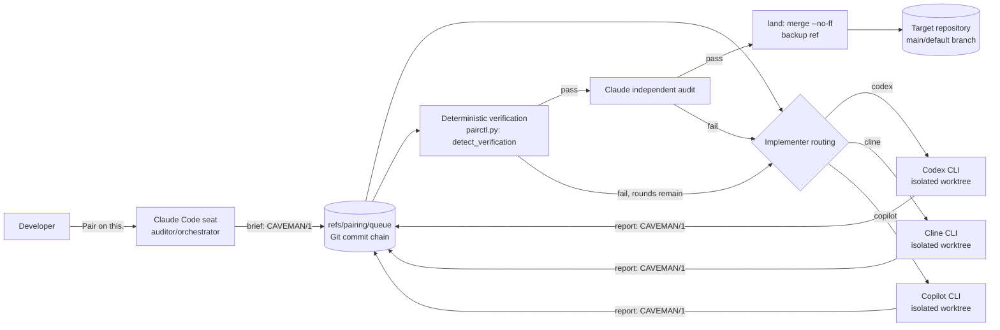

<div align="center">
  
</div>

# Ghostrider

A token-conscious multi-agent pairing engine for **Claude Code, Codex CLI, Cline, and GitHub Copilot CLI**.

## The Rundown

Ghostrider is a Claude Code Agent Skill that lets one AI seat (Claude) delegate hands-on implementation work to a second AI seat (Codex, Cline, or GitHub Copilot CLI), then independently audit the result before it is merged (SKILL.md:6-15). Claude is the default auditor/orchestrator; the implementing seat is chosen by config, profile, `--implementer`, or `auto` routing, and the skill explicitly refuses to collapse implementation and independent audit into the same seat when an auditor is available (SKILL.md:8-15).

The point of the exercise is cost. Running two AI agents together usually means re-pasting source code, instructions, and history between them on every turn. Ghostrider replaces that with **CAVEMAN/1 (`CVM1`)**, a compact wire format that sends goals, deltas, acceptance criteria, commands, hashes, and failures instead of essays (SKILL.md:17-27, `references/caveman.md`). The everyday user experience is one sentence:

```text
Pair on this.
```

optionally naming a seat (`Pair on this using Codex.`) (SKILL.md:46-60).

Under the hood, `scripts/pairctl.py` (1,522 lines, Python 3.8+, standard library only, no `requirements.txt`/`pyproject.toml`/lockfile anywhere in the repo) is the entire deterministic runtime: config loading, a Git-ref task queue, the CAVEMAN/1 codec, worktree lifecycle, verification discovery/execution, and every `pair`/`report`/`audit`/`land`/`rollback`/`resume` subcommand (scripts/pairctl.py:121-1521). Each implementation task runs in its own isolated Git worktree so the implementing agent cannot collide with or corrupt the primary working tree (SKILL.md:8-15, `references/protocol.md:7-9`). Work is deterministically verified (build/test commands discovered from the target repository) and then independently audited by Claude before merge; the implementer's own claim of success is treated as a claim, never as evidence (SKILL.md:183-224, `references/protocol.md:1-5`).

Coordination state, the task queue, its full history, and the audit trail, lives entirely as a Git commit chain on `refs/pairing/queue` inside the target repository (`references/protocol.md:7-9`, scripts/pairctl.py:403-460). There is no server and no database. Failure handling is bounded and explicit: a fixed number of automatic repair rounds per profile, then a human-visible `blocked` or `max-rounds` state instead of silent infinite retries (`references/protocol.md:21-23`). Landing only happens after an explicit audit pass, with an automatic backup ref and a documented rollback command (SKILL.md:225-239, `references/protocol.md:25-27`).

No user, customer, or business data flows through Ghostrider. It shells out to locally installed CLIs (`git`, `codex`, `cline`, `copilot`) and does nothing over the network; no HTTP client, SDK, or API-key handling exists anywhere in `scripts/pairctl.py` or `install.py` (verified during this scan). There is no CI configuration, no Dockerfile, and no container/IaC in the repository; distribution is `install.py` copying the skill directory into each tool's skill location (install.py:26-49, 142-196). The closest thing to a contribution gate is `tests/test_smoke.py` (339 lines, standard-library `unittest`), which drives install/uninstall and a full pair/verify/audit/land/rollback cycle against a fake implementing-agent CLI.

Start reading at `SKILL.md` for the agent-facing policy the orchestrating seat follows, then `scripts/pairctl.py` for the actual mechanics, `references/protocol.md` for the lifecycle state machine, and `references/cli.md` for every subcommand.

## Last Updated

- Last Updated: 2026-09-15
- Last Commit Date: 2026-09-15 (git log, commit `6b2ff8a`)

## Table of Contents

- [The Rundown](#the-rundown)
- [Repository Overview](#repository-overview)
- [Components / Projects / Packages](#components-projects-packages)
- [Architecture Overview](#architecture-overview)
- [Tech Stack and Dependencies](#tech-stack-and-dependencies)
- [Project Layout](#project-layout)
- [Getting Started (Local Development)](#getting-started-local-development)
- [Configuration](#configuration)
- [Running the System](#running-the-system)
- [Deployment and CI/CD](#deployment-and-cicd)
- [Deep Code Reference (Wiki Section)](#deep-code-reference-wiki-section)
- [Data and Integrations](#data-and-integrations)
- [Security Notes](#security-notes)
- [Observability and Monitoring](#observability-and-monitoring)
- [Common Tasks and Troubleshooting](#common-tasks-and-troubleshooting)
- [Change Log](#change-log)
- [Contributing / Coding Standards](#contributing-coding-standards)
- [License](#license)

## Repository Overview

Ghostrider is a Claude Code Agent Skill (single directory, distributed as-is) that adds multi-agent "paired programming" to Claude Code, Codex CLI, Cline, and GitHub Copilot CLI. Claude acts as the default independent auditor/orchestrator; one of Codex, Cline, or Copilot acts as the implementing seat inside an isolated Git worktree (SKILL.md:1-15). Seat-to-seat traffic uses the compact CAVEMAN/1 wire protocol instead of re-pasting source and history (SKILL.md:17-44). The repository ships the skill definition, the deterministic runtime, per-adapter integration notes, and a standard-library smoke-test suite. Inventory: 88 files total in the working tree, of which 14 are first-party (source, docs, config, and the banner asset), the remainder Git metadata and two generated `__pycache__` artifacts.

## Components / Projects / Packages

| Component | Type | Language/Framework | Runtime/Target | Path | Purpose |
| --- | --- | --- | --- | --- | --- |
| Skill definition | Agent Skill policy document | Markdown (YAML frontmatter) | Read by Claude Code, Codex, Cline, Copilot | `SKILL.md` | Behavioral policy the orchestrating agent follows (SKILL.md:1-15) |
| Runtime CLI | Command-line tool | Python 3.8+, stdlib only | `python scripts/pairctl.py <cmd>` | `scripts/pairctl.py` | Deterministic queue, worktree, verification, audit and landing mechanics (scripts/pairctl.py:1-15) |
| Installer | Command-line tool | Python 3.8+, stdlib only | `python install.py` | `install.py` | Copies the skill into Claude/Codex/Cline/Copilot skill directories, seeds config (install.py:1-20) |
| Codex agent descriptor | Configuration | YAML | Read by Codex CLI | `agents/openai.yaml` | Declares display name, default prompt, and invocation policy for Codex's agent registry (agents/openai.yaml) |
| Reference docs | Documentation | Markdown | Read on demand by the agent | `references/*.md` | Protocol, adapters, CAVEMAN packet format, CLI reference, migration notes (references/) |
| Banner image | Asset | PNG | N/A | `references/ghostrider.png` | Skill banner/artwork used in this README |
| Smoke tests | Test suite | Python 3 `unittest` | `python tests/test_smoke.py` | `tests/test_smoke.py` | End-to-end install and pair/verify/audit/land/rollback coverage (tests/test_smoke.py) |

## Architecture Overview



Evidence: SKILL.md:8-15, SKILL.md:128-233, `references/protocol.md:1-27`, scripts/pairctl.py:696-953 (dispatch/verify), scripts/pairctl.py:1201-1254 (land/rollback command handlers).

## Tech Stack and Dependencies

- Language: Python 3.8+ (install.py:4).
- Dependencies: none, standard library only. No `requirements.txt`, `pyproject.toml`, `setup.py`, or lockfile exists in the repository.
- Version control integration: Git, invoked as a subprocess (`git update-ref`, `git worktree`, `git log`, etc.), no Git Python binding is used (scripts/pairctl.py:314-334, `references/protocol.md:7-9`).
- Configuration format: JSON (`~/.pairing/config.json`) plus an optional dependency-free TOML/JSON per-repository override (`.pairing.toml` / `.pairing.json`) (SKILL.md:271-297, install.py:112-146).
- Test framework: `unittest` (Python standard library) (tests/test_smoke.py).
- Packaging: none. The skill is distributed as a plain directory and installed by copying (`install.py`), not via PyPI, npm, or any package manager (install.py:47-70).
- External CLIs orchestrated (not bundled): `codex`, `cline`, `copilot`, all invoked as subprocesses if present on `PATH` (`references/adapters.md`).

## Project Layout

```text
ghostrider/
  SKILL.md              - agent-facing policy and workflow (304 lines)
  README.md             - this file
  install.py            - installer for Claude/Codex/Cline/Copilot (225 lines)
  agents/
    openai.yaml          - Codex CLI agent descriptor
  scripts/
    pairctl.py            - deterministic runtime CLI (1,522 lines)
  references/
    protocol.md            - lifecycle/state-machine reference
    adapters.md             - per-CLI (Codex/Cline/Copilot) adapter details
    caveman.md              - CAVEMAN/1 wire-format reference
    cli.md                  - full pairctl.py subcommand reference
    migration.md            - migration notes from the prior "pairing.py" tool
    ghostrider.png          - banner image used in this README
  tests/
    test_smoke.py           - standard-library end-to-end smoke tests (339 lines)
```

Evidence: repository working-tree listing outside `.git/` (14 first-party files, 6 directories).

## Getting Started (Local Development)

Prerequisites: Python 3.8+ and Git on `PATH`. No third-party packages need to be installed (install.py:4-5).

Install the skill for every supported client:

```bash
python install.py --target all
```

Install for a single client:

```bash
python install.py --target claude
python install.py --target codex
python install.py --target cline
python install.py --target copilot
```

Project-local install instead of the user-level skill directory:

```bash
python install.py --target all --scope project --project /path/to/repo
```

Replace an existing installed copy:

```bash
python install.py --target all --force
```

Evidence: install.py:73-217.

## Configuration

Shared configuration is a JSON file, `~/.pairing/config.json` by default, overridable with the `PAIRING_HOME` environment variable (install.py:129, SKILL.md:271-279 for profile-level config; `references/cli.md` for keys). Known configuration keys (names only, this repository defines no secret values):

| Key | Purpose |
| --- | --- |
| `enabled` | global pairing on/off switch (install.py:114-115) |
| `implementer` | default implementing CLI: `auto`, `codex`, `cline`, `copilot` (install.py:116-117) |
| `implementer_priority` | ordered list `auto` uses to pick the first installed CLI (`references/adapters.md`) |
| `codex_sandbox` | Codex sandbox mode: `read-only`, `workspace-write`, `danger-full-access` (install.py:118-119, `references/adapters.md`) |
| `cline_thinking` | Cline reasoning level: `none`, `low`, `medium`, `high`, `xhigh` (install.py:120-121) |
| `copilot_model` | Copilot CLI model name, e.g. `auto` (install.py:122-123) |
| `copilot_yolo` | allow Copilot fully non-interactive `--yolo` runs; off by default (install.py:124-125, `references/adapters.md`) |
| `dispatch_output` | whether dispatched CLI output is logged only or inherited into context (`references/cli.md`) |

Repository-local overrides: a target repository may contain `.pairing.toml` or `.pairing.json` with `[pairing]` (profile, implementer), `[verification]` (explicit verification commands), and `[profile.<name>]` blocks (SKILL.md:281-297).

## Running the System

Everyday use is a single natural-language instruction inside Claude Code:

```text
Pair on this.
```

Naming the implementer explicitly:

```text
Pair on this using Codex.
Pair on this using Cline.
Pair on this using Copilot.
```

Direct runtime invocation (what the skill drives under the hood):

```bash
python scripts/pairctl.py status
python scripts/pairctl.py doctor
python scripts/pairctl.py pair "Implement feature X" --spec brief.json --implementer codex
python scripts/pairctl.py pair "Implement feature X" --spec brief.json --implementer cline
python scripts/pairctl.py pair "Implement feature X" --spec brief.json --implementer copilot
python scripts/pairctl.py config implementer auto
```

Full subcommand reference: `references/cli.md`. Lifecycle states a run passes through: `briefed -> worktree-ready -> implementing -> reported -> verification -> audit-ready -> audit-passed -> landed -> cleaned`, with failure states `verification-failed`, `repair-ready`, `blocked`, `max-rounds`, `rolled-back` (`references/protocol.md:11-15`).

Uninstall:

```bash
python install.py --target all --uninstall
```

Uninstall removes only the installed skill copies; shared config, logs, worktrees with in-progress work, and repository queue history are left in place intentionally (install.py:148-160).

## Deployment and CI/CD

Insufficient Evidence for a deployment pipeline: the repository contains no CI configuration, no Dockerfile, and no container/IaC definitions or publish/release scripts. Distribution is manual: a user or agent runs `install.py` to copy the skill directory into a target CLI's skill location (install.py:47-70, 163-217).

## Deep Code Reference (Wiki Section)

### Cross-Reference Index

| Component/Module/Class/Function | File Path | Key Methods | Notes |
| --- | --- | --- | --- |
| `Console` | `scripts/pairctl.py:125` | `say`, `step`, `warn` | human-facing console output |
| Config loading | `scripts/pairctl.py:162-312` | `load_raw_config`, `load_config`, `save_raw_config`, `load_repo_settings`, `effective_config` | JSON global config plus dependency-free TOML/JSON repo overrides merged into one effective config |
| Git helpers | `scripts/pairctl.py:314-397` | `git`, `repo_root`, `common_repo_root`, `working_tree_clean`, `current_branch`, `channel_ready`, `has_github` | thin subprocess wrapper around the `git` binary |
| Queue (Git-ref) | `scripts/pairctl.py:403-470` | `queue_load`, `queue_commit`, `next_id`, `find_brief` | reads/writes the `refs/pairing/queue` commit chain with compare-and-swap |
| CAVEMAN/1 codec | `scripts/pairctl.py:492-595` | `cvm_encode`, `cvm_parse`, `cvm_escape`, `cvm_unescape`, `lint_brief` | encodes/decodes/validates the compact wire packets described in `references/caveman.md` |
| Worktree lifecycle | `scripts/pairctl.py:643-695` | `worktree_path`, `ensure_worktree`, `cleanup_worktree` | creates/removes the isolated Git worktree per brief |
| Verification | `scripts/pairctl.py:696-799` | `detect_verification`, `run_verification`, `verification_wire` | discovers and runs repository build/test commands, produces the compact wire summary |
| CLI subcommands | `scripts/pairctl.py:800-1455` | `cmd_init`, `cmd_brief`, `cmd_claim`, `cmd_requeue`, `cmd_report`, `cmd_pair`, `cmd_audit`, `cmd_land`, `cmd_rollback`, `cmd_resume`, plus 12 more | one function per `argparse` subcommand; full list in `references/cli.md` |
| Installer | `install.py` | `copytree_atomicish`, `_force_remove`, `user_destinations`, `project_destinations`, `set_initial_config`, `uninstall`, `main` | atomic-ish copy-install/uninstall for four target CLIs at user or project scope; `_force_remove` works around Windows refusing to unlink read-only `.git/objects` files during reinstall (install.py:19-36) |
| Smoke tests | `tests/test_smoke.py` | `PairingV4Tests` (unittest) | drives install, a fake implementing-agent CLI, and a full pair/verify/audit/land/rollback cycle |

No web or API surface exists in this repository (it is a local CLI tool); the API Surface subsection is intentionally omitted.

## Data and Integrations

- Persistent state: a Git commit chain on `refs/pairing/queue` inside the target repository being paired on, no external database (`references/protocol.md:7-9`).
- Local files: `~/.pairing/config.json` (shared config), `~/.pairing/logs/` (full command output), worktrees under `~/.pairing/` by default.
- External integrations: none over the network. Ghostrider shells out to locally installed CLIs (`git`, `codex`, `cline`, `copilot`) only; no HTTP client, SDK, or API key handling exists in `scripts/pairctl.py` or `install.py`.

## Security Notes

- No secrets, credentials, or tokens were found in the repository during this scan.
- No authentication/authorization layer exists in this repository, it is a local developer tool, not a service.
- The implementing seat's sandboxing is delegated to the underlying CLI: `codex_sandbox` (default `workspace-write`), Cline's auto-approval setting, and Copilot's `copilot_yolo` flag (default `off`, since enabling it appends `--yolo` and grants broad permissions beyond the worktree) (`references/adapters.md`, SKILL.md:299-304).
- SKILL.md explicitly documents that Git worktree isolation "prevents edit collisions; it is not a security sandbox for arbitrary shell commands" (SKILL.md:304).
- Queue writes use Git compare-and-swap (`git update-ref`) so two competing claims cannot both succeed, which is a correctness/integrity control rather than an authentication control (`references/protocol.md:7-9`).

## Observability and Monitoring

- Structured, greppable lifecycle events are recorded per brief and can be read with `pairctl.py events ID --ndjson` (`references/cli.md`).
- Queue state itself is inspectable at any time: `pairctl.py queue`, `pairctl.py status [ID]`, `pairctl.py show ID --json` (`references/cli.md`).
- Full command/verification output is written to local log files under `~/.pairing/logs/` by default rather than being replayed into an agent's context window, keeping the CAVEMAN/1 wire packets small (scripts/pairctl.py:744-799).
- There is no metrics/tracing integration (no OpenTelemetry, Prometheus, or similar dependency exists in the repository).

## Common Tasks and Troubleshooting

| Task | Command |
| --- | --- |
| Check runtime health and adapter availability | `python scripts/pairctl.py doctor` |
| Check current pairing status | `python scripts/pairctl.py status` |
| List/inspect the task queue | `python scripts/pairctl.py queue --repo <repo>` |
| Inspect one queue entry | `python scripts/pairctl.py status <id> --repo <repo>` / `show <id> --json` |
| Resume an interrupted round | `python scripts/pairctl.py resume <id> --repo <repo>` |
| Requeue a stale/dead claim | `python scripts/pairctl.py resume <id> --requeue --repo <repo>` |
| Redispatch after requeue | `python scripts/pairctl.py resume <id> --redispatch --repo <repo>` |
| Undo a landed merge (no history rewrite) | `python scripts/pairctl.py rollback <id> --repo <repo> --seat claude` |
| Switch the default implementer | `python scripts/pairctl.py config implementer auto` |
| Replace an existing skill install | `python install.py --target all --force` |

Evidence: SKILL.md:64-260, `references/cli.md`.

## Change Log

No version tags or release notes exist in the repository at scan time; the queue schema constant in `scripts/pairctl.py:87` reports `"version": 4` for the skill's own internal config format, not a product release number. Recent repository history (from `git log`, most recent first):

- Fixed: agent dispatch no longer inherits stdin, preventing a dispatched CLI from blocking on unexpected interactive input.
- Changed: the Codex seat can now commit inside a linked worktree.
- Fixed: `install.py` tolerates read-only files on Windows during reinstall (the `_force_remove` workaround for `.git/objects` permissions, install.py:19-36).
- Fixed: Windows dispatch, prompt truncation, and verification crashes.
- Changed: the "pairing" skill was renamed to "ghostrider" and a generated README was added.

## Contributing / Coding Standards

- No `CONTRIBUTING.md`, linter configuration, or formatter configuration was found in the repository during this scan.
- The codebase is standard-library-only Python; `scripts/pairctl.py` and `install.py` use `from __future__ import annotations` and full type hints on function signatures throughout.
- The test suite (`tests/test_smoke.py`) is the closest thing to a contribution gate present in the repository; run it with `python tests/test_smoke.py` before proposing changes.
- SKILL.md itself encodes several hard rules for anyone extending the runtime, notably: do not collapse the auditing and implementing seat into one when an independent auditor is available (SKILL.md:13), and never let deterministic verification substitute for Claude's independent semantic audit (SKILL.md:147, 183-192).

## License

Insufficient Evidence, no `LICENSE` file exists in the repository at scan time.
